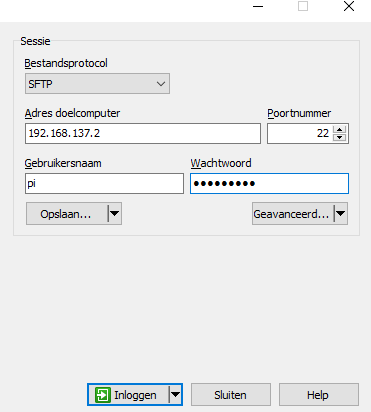

# Trainingssessie Raspberry Pi
Onze introductie Powerpoint kan je [hier](https://github.com/robbertvanhove/Trainingssessie-Raspberry-Pi/blob/master/Presentaties/Rpi.pptx) terugvinden
## 1. Installatie raspbian
Wij hebben voor jullie het besturingssysteem vooraf al geïnstalleerd. Als je dit zelf eens wil uitproberen, kan je volgende handleiding volgen: https://www.raspberrypi.org/documentation/installation/installing-images/README.md

## 2. Raspberry Pi verbinden met je pc
### Verander het IP-adres van je netwerkkaart
Ga naar configuratiescherm > netwerk en internet > netwerkcentrum
Klik hier op adapterinstellingen wijzigen


Klik met de rechtermuisknop op de adapter van je ethernet-poort en kies dan eigenschappen


Selecteer vervolgens "Internet Protocol versie 4" en klik op eigenschappen


Kies voor "Het volgende IP-adres gebruiken" en vul vervolgens 192.168.137.1 in als IP-adres en 255.255.255.0 al subnetmasker en klik op "OK"


### Deel je Wi-Fi

Klik met je rechtermuisknop op je wifi-verbinding en kies "eigenschappen"


klik vervolgens op "delen" en vink de eerste checkbox aan


### Verbinden met je Raspberry Pi via Putty
Verbind eerst je pc en je Raspberry Pi via een netwerkkabel

Open Putty


Vul als IP-adres 192.168.137.2 in en zorg er zeker voor dat de poortnummer 22 is.


Klik nu op "Open"


Vervolgens krijg je een login scherm te zien. Standaard  is de gebruikersnaam "pi" en het wachtwoord "raspberry"


Als je bent ingelogd krijg je volgend scherm te zien:

### Verbinden met WinSCP
Open WinScp
Vul bij "adres doelcomputer" het IP-adres van je Raspberry PI in.(192.168.137.2) 
Vul als gebruikersnaam "pi" in en als wachtwoord "raspberry".
Controleer ook weer of de poort op nummer 22 staat ingesteld.



Klik op inloggen
Je krijgt volgend scherm te zien:


## 3. De nodige libraries installeren
Vooraleer we effectief gaan werken met onze Pi, moeten er eerst enkele dingen geïnstalleerd worden.

Voer volgende commando's uit in Putty:

```
sudo apt-get update
sudo apt-get install python-dev
sudo apt-get install python-rpi.gpio
```

## 4. Ledje aansturen
Het script om het ledje aan te sturen vind je [hier](https://github.com/robbertvanhove/Trainingssessie-Raspberry-Pi/blob/master/Scripts/led.py)

### Commando's
Rechten wijzigen:
`sudo chmod u+x led.py`
Script uitvoeren:
`sudo python led.py`


## 5. Installatie CGI-server
```
mkdir server
cd server
mkdir cgi-bin
```
Server starten: 
`python -m CGIHTTPServer 8080`
Server stoppen:
ctrl+c
## 6. Ledje aansturen via browser
* Maak een nieuw script 'ledtest.py' en plaats het in de map 'cgi-bin'
* Plaats de code uit [deze link](https://github.com/robbertvanhove/Trainingssessie-Raspberry-Pi/blob/master/Scripts/ledtest.py) in het bestand.
* Start de cgi-server in de map 'server'.
* Om het lampje aan te zetten surf je in je browser naar http://192.168.137.2:8080/cgi-bin/ledtest.py?1
* Om het uit te zetten surf je naar http://192.168.137.2:8080/cgi-bin/ledtest.py?0

### Aansturing via webpagina
* Maak een nieuw bestand 'index.html' en plaats het in de map 'server'
* Plaats de code uit [deze link](https://github.com/robbertvanhove/Trainingssessie-Raspberry-Pi/blob/master/Scripts/ledtest.py) in het bestand
* Surf naat http://192.168.137.1/server/index.html 

We willen dit natuurlijk met een mooie interface doen. Maak een bestand in de map server genaamd "index.html" en plaats er de code uit [deze link](https://github.com/robbertvanhove/Trainingssessie-Raspberry-Pi/blob/master/Scripts/control.html) in.


